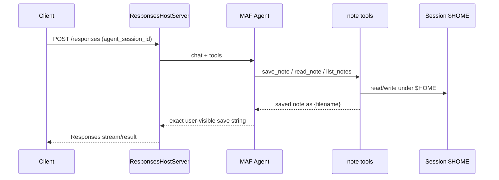

# Plan: Foundry hosted notes agent (MAF + ResponsesHostServer)

**Repo:** `giomem3392/test_hr`  
**Feature branch:** `feature/foundry-notes-agent` (created in PLAN stage; Implementor opens PR to `main` when build is done)  
**Source of truth:** `.grok/.researcher/research.md` on `main`  
**Owner for all implementation steps:** Implementor  
**Out of scope this build:** live Azure provision/deploy; Bicep eject unless blocked; BYO `azure-ai-agentserver-*` stack

**Later artifact:** Implementor writes `.grok/.implementor/implementation.md` after code + PR (path reserved for BUILD stage).

---

## Locked decisions

| # | Decision |
|---|----------|
| 1 | **MAF** + `ResponsesHostServer` (not BYO agentserver-only) |
| 2 | User-visible save reply exactly `saved note as {filename}` (tool return + agent instructions; no extra words) |
| 3 | One file per note under `$HOME`; model chooses sanitized filename; default `.txt` if no extension; overwrite OK; reject `..` and absolute paths |
| 4 | Model deployment name in `azure.yaml`: `gpt-4.1-mini` (README documents catalog/version fallback) |
| 5 | Deploy mode **code** (`language: python` + `codeConfiguration`); protocol **2.0.0** |
| 6 | Tools: `save_note`, `read_note`, optional `list_notes` — agent-only (no Session Files operator UI requirement) |
| 7 | Env: prefer `AZURE_AI_MODEL_DEPLOYMENT_NAME`; also accept `MICROSOFT_FOUNDRY_MODEL_DEPLOYMENT_NAME` if set |
| 8 | Ship templates + code + CI + README; no live Azure deploy required for DoD |

---

## Target repo layout

```text
test_hr/
├── azure.yaml
├── .grok/
│   ├── .researcher/research.md
│   ├── .planner/plan.md          # this file
│   └── .implementor/implementation.md  # BUILD stage
├── src/
│   └── notes-agent/
│       ├── main.py               # Agent + tools + ResponsesHostServer.run()
│       ├── notes.py              # $HOME path helpers + sanitize
│       ├── requirements.txt
│       ├── .agentignore          # if sample/docs recommend
│       └── .env.example
├── .github/workflows/ci.yml      # ruff + mypy on PRs
├── pyproject.toml                # optional root; or requirements-dev.txt for CI
└── README.md                     # architecture Mermaid + azd local guidance
```

No Dockerfile unless code mode proves insufficient (prefer code).

---

## Package pins (from research, 2026-09-06)

| Package | Pin / guidance |
|---------|----------------|
| `agent-framework` | `1.17.0` |
| `agent-framework-foundry` | `1.12.0` |
| `agent-framework-foundry-hosting` | `1.0.0b260903` (prerelease; pin explicitly; protocol 2.0.0) |
| `azure-identity` | current stable pin |
| `python-dotenv` | optional, for local `.env` |
| `ruff` (dev) | `0.16.6` |
| `mypy` (dev) | `2.3.1` |

Do **not** mix BYO `azure-ai-agentserver-responses` with MAF hosting packages.

---

## Numbered implementation steps

### Step 1 — Scaffold `src/notes-agent/` package layout
**Owner:** Implementor  
**Work:**
- Create `src/notes-agent/` with `main.py`, `notes.py`, `requirements.txt`, `.env.example`, and `.agentignore` if warranted by MAF/Foundry samples.
- Pin runtime deps in `requirements.txt` per table above (`--pre` may be needed for hosting package).
- Add root `pyproject.toml` or `requirements-dev.txt` with `ruff==0.16.6` and `mypy==2.3.1` for CI.

**Success criteria:**
- [ ] Layout matches target tree (minus optional `infra/`).
- [ ] Runtime pins match research; no BYO agentserver packages.
- [ ] `.env.example` documents `FOUNDRY_PROJECT_ENDPOINT`, `AZURE_AI_MODEL_DEPLOYMENT_NAME`, and optional `MICROSOFT_FOUNDRY_MODEL_DEPLOYMENT_NAME`.

---

### Step 2 — Implement note filesystem helpers (`notes.py`)
**Owner:** Implementor  
**Work:**
- Resolve notes root as `Path(os.environ.get("HOME", Path.home()))` (Foundry session `$HOME`).
- `sanitize_filename(name: str) -> str`:
  - Reject absolute paths and any segment/`..` traversal.
  - Allow only safe chars (alnum, `-`, `_`, `.`); normalize or reject unsafe names with a clear error string.
  - If no extension after sanitize, append `.txt`.
- `save_note(filename, content) -> str`: write UTF-8 under `$HOME` (overwrite OK); return exactly `saved note as {filename}` using the final on-disk basename (post-sanitize / default extension).
- `read_note(filename) -> str`: read UTF-8 or return a clear not-found / sanitize-error message (not a stack trace).
- Optional `list_notes() -> str`: list note filenames under `$HOME` (non-recursive, files only).

**Success criteria:**
- [ ] Unit-testable pure helpers (or small local tests) cover: happy path, overwrite, missing extension → `.txt`, reject `../x`, reject `/etc/passwd`, read missing file.
- [ ] Save return string matches `saved note as {filename}` with no extra punctuation or words.

---

### Step 3 — Wire MAF Agent + `@tool` + `ResponsesHostServer` (`main.py`)
**Owner:** Implementor  
**Work:**
- Import pattern per research:
  - `Agent` from `agent_framework`
  - `FoundryChatClient` from `agent_framework.foundry`
  - `ResponsesHostServer` from `agent_framework_foundry_hosting`
  - `DefaultAzureCredential` from `azure.identity`
  - `@tool` (not legacy `@ai_function`)
- Resolve model deployment name: `os.environ.get("AZURE_AI_MODEL_DEPLOYMENT_NAME") or os.environ.get("MICROSOFT_FOUNDRY_MODEL_DEPLOYMENT_NAME")`; fail fast with a clear error if neither is set.
- Build `FoundryChatClient(project_endpoint=os.environ["FOUNDRY_PROJECT_ENDPOINT"], model=..., credential=DefaultAzureCredential())`.
- Register tools wrapping `notes.py`: `save_note`, `read_note`, and optional `list_notes`.
- Agent instructions must state:
  - Choose a short descriptive filename from note content (slug).
  - On successful save, the user-visible reply must be exactly the tool return: `saved note as {filename}` with no extra words.
  - Use `read_note` / `list_notes` to retrieve prior notes in the same session.
- `default_options={"store": False}` (platform manages Responses history).
- Entrypoint: `ResponsesHostServer(agent).run()` (default port 8088 / `/responses`).

**Success criteria:**
- [ ] Module imports and starts locally when env vars are set (or dry-run import check in CI if credentials absent).
- [ ] Tools use `@tool`; no BYO ResponsesAgentServerHost.
- [ ] Instructions + tool return enforce exact save reply contract.

---

### Step 4 — Author root `azure.yaml`
**Owner:** Implementor  
**Work:**
- Unified `azure.yaml` with:
  - `requiredVersions`: `azd >= 1.27.1`; extensions `azure.ai.agents >= 1.0.0-beta.9` (prefer ≥1.0.0-beta.11 if using `sessionConfiguration`); `azure.ai.projects >= 1.0.0-beta.4`.
  - Service `ai-project`: `host: azure.ai.project`; deployment named `gpt-4.1-mini` with OpenAI format model `gpt-4.1-mini`, sku `GlobalStandard`, modest capacity (e.g. 10). Document in README that model `version` must be filled from regional catalog at `azd` init time if required by schema.
  - Service `notes-agent`: `host: azure.ai.agent`, `kind: hosted`, `uses: [ai-project]`, `project: src/notes-agent`, `language: python`, `codeConfiguration.runtime: python_3_13`, `entryPoint: main.py`, `protocols: [{protocol: responses, version: "2.0.0"}]`, `env.AZURE_AI_MODEL_DEPLOYMENT_NAME: ${AZURE_AI_MODEL_DEPLOYMENT_NAME}`, container resources e.g. `cpu: "0.25"`, `memory: 0.5Gi`, optional `sessionConfiguration.idleTimeoutSeconds: 900`.
- Do **not** declare `FOUNDRY_PROJECT_ENDPOINT` in `env` (platform-reserved `FOUNDRY_` / `AGENT_` prefixes).

**Success criteria:**
- [ ] File validates against documented azure.yaml shape from research.
- [ ] Protocol version is exactly `2.0.0`; deploy mode is code (no required Dockerfile).
- [ ] Model deployment name is `gpt-4.1-mini`.

---

### Step 5 — GitHub Actions CI (`.github/workflows/ci.yml`)
**Owner:** Implementor  
**Work:**
- Workflow on `pull_request` to `main` (and optionally `push` to feature branches).
- Jobs: install Python 3.13 (or 3.12+ if 3.13 unavailable on runners — match `codeConfiguration` as closely as possible), install runtime + dev deps, run:
  - `ruff check src`
  - `ruff format --check src`
  - `mypy src` (configure `mypy.ini` / `pyproject.toml` with reasonable strictness; allow gradual typing if MAF stubs are incomplete — document ignores narrowly).

**Success criteria:**
- [ ] PR CI runs ruff lint + format check + mypy.
- [ ] Workflow fails the PR if any of those fail.
- [ ] No always-passing stub job.

---

### Step 6 — README with Mermaid architecture
**Owner:** Implementor  
**Work:**
- Update `README.md` to describe the notes agent, locked decisions, and how to use `azd` locally (`azd ai agent init` / `run` / `invoke`) **without** requiring a live deploy for this task’s DoD.
- Include a **Mermaid** diagram covering request → Responses `/responses` → MAF Agent → tools → `$HOME` notes, plus session binding (`agent_session_id` / `conversation`) vs conversation history (`previous_response_id`).
- Document:
  - Exact save reply contract.
  - Filename sanitize rules and `.txt` default.
  - Env var preference order for model deployment name.
  - Model catalog/version fallback if `gpt-4.1-mini` unavailable in region.
  - Warning: multi-turn note retrieve needs stable `agent_session_id` or `conversation`, not only `previous_response_id`.

**Example Mermaid (Implementor may refine labels):**



**Success criteria:**
- [ ] README includes Mermaid for request/session/notes flow.
- [ ] Local/azd guidance present; no claim that live Azure deploy was performed unless it was.
- [ ] Catalog/version fallback for `gpt-4.1-mini` documented.

---

### Step 7 — Branch hygiene, PR, and `implementation.md`
**Owner:** Implementor  
**Work:**
- All build work stays on `feature/foundry-notes-agent` (already created in PLAN; rebase/merge from `main` if needed before PR).
- When Steps 1–6 are done and CI is green on the PR: open PR **to `main`** (do not merge in BUILD stage unless orchestrator says so).
- Write `.grok/.implementor/implementation.md` summarizing what shipped, pins used, PR URL, and residual risks.

**Success criteria:**
- [ ] PR exists targeting `main` with CI (ruff + mypy) green.
- [ ] `.grok/.implementor/implementation.md` exists and references the PR.
- [ ] No merge to `main` by Implementor unless explicitly requested later.

---

## Definition of done (BUILD stage)

- [ ] Repo layout per this plan (`azure.yaml`, `src/notes-agent/`, CI, README Mermaid).
- [ ] MAF Agent + `@tool` notes + `ResponsesHostServer`.
- [ ] `azure.yaml`: Foundry project + `gpt-4.1-mini` + hosted python agent, protocol 2.0.0, code deploy.
- [ ] `.github/workflows/ci.yml`: ruff + mypy on PRs.
- [ ] README updated with Mermaid (request/session/notes flow).
- [ ] Work on `feature/foundry-notes-agent`; Implementor opens PR to `main`.
- [ ] `.grok/.implementor/implementation.md` written.
- [ ] Package pins from research applied.
- [ ] No live Azure deploy required.

---

## Residual risks (carry into BUILD)

1. **Env var drift** — Foundry/azd may inject alternate model env names; code accepts both preferred names.
2. **Hosting package prerelease** — pin `agent-framework-foundry-hosting==1.0.0b260903`; re-test on upgrade.
3. **LLM paraphrase** — harden save reply via tool return + strict instructions (optional host middleware only if still violated).
4. **Session vs conversation** — clients must pass `agent_session_id` or `conversation` for `$HOME` reuse.
5. **Model catalog** — `gpt-4.1-mini` version/availability is region-dependent; README fallback path required.
6. **mypy vs MAF stubs** — may need narrow type ignores; keep CI useful, not vacuous.

---

## Anti-patterns for Implementor

- Do not switch to BYO agentserver-only.
- Do not weaken the exact `saved note as {filename}` contract.
- Do not use protocol `1.0.0`.
- Do not declare reserved `FOUNDRY_*` / `AGENT_*` env keys in `azure.yaml` `env`.
- Do not leave stub or unfinished files in the PR.
- Do not merge to `main` in this stage.
