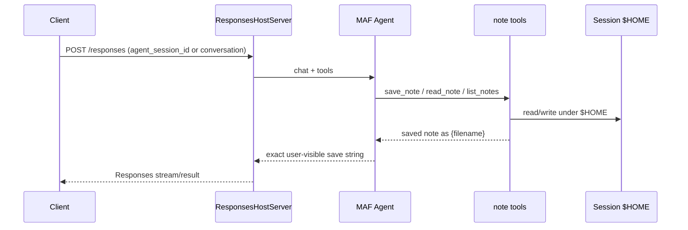

# Foundry hosted notes agent (`test_hr`)

Microsoft Agent Framework (MAF) Python agent as an Azure AI Foundry **hosted agent** (Responses protocol **2.0.0**, code deploy). The model saves and reads **one file per note** under the session `$HOME` via `@tool` helpers.

Reviewing this PR does **not** require a live Azure deploy.

## Locked behavior

| Item | Choice |
|------|--------|
| Stack | MAF + `ResponsesHostServer` (not BYO `azure-ai-agentserver-*`) |
| Save reply | Exactly `saved note as {filename}` |
| Files | One file per note under `$HOME`; sanitized basename; default `.txt`; overwrite OK; no path escape |
| Model deployment | `gpt-4.1-mini` in `azure.yaml` |
| Protocol | Responses `2.0.0` |
| Deploy mode | Code (`language: python` + `codeConfiguration`) |
| Model env | Prefer `AZURE_AI_MODEL_DEPLOYMENT_NAME`; also accept `MICROSOFT_FOUNDRY_MODEL_DEPLOYMENT_NAME` |

## Architecture



Keep a stable `agent_session_id` or `conversation` for multi-turn note retrieve. `previous_response_id` alone does **not** reuse `$HOME`.

## Filename rules

- Safe chars: letters, digits, `-`, `_`, `.` (single segment; no `..` / absolute paths)
- Missing extension → `.txt`; overwrite OK
- `list_notes` returns only `.txt` / `.md` under `$HOME`
- Save reply: `saved note as {filename}` (final on-disk basename)

---

## 1. Setup and create Foundry project

**You can supply / choose the Foundry project name.** Do not confuse it with other names in this repo:

| Name | Where | What |
|------|--------|------|
| **azd app name** | Root `azure.yaml` → `name: test-hr-notes` | azd environment / resource-prefix name — **not** the Foundry project |
| **Foundry account** | Hostname of the endpoint | `{account}` in `https://{account}.services.ai.azure.com/...` |
| **Foundry project** | Path segment of the endpoint | `{project}` in `.../api/projects/{project}` — **this is the project name** |
| **Hosted agent** | `azure.yaml` → `services.notes-agent.name` | Agent resource inside the project (`notes-agent`) |

**Project endpoint shape:**

```text
https://<foundry-account>.services.ai.azure.com/api/projects/<foundry-project-name>
```

Portal: project overview / **Manage → Project details** shows name, parent account, Resource ID, and endpoint.

### Create or choose the project (pick one)

**A. Explicit name (portal or Azure CLI)** — best when you want a specific string:

1. Portal: [ai.azure.com](https://ai.azure.com) → **Create new project** → enter the project name.  
   Or CLI (after the Foundry **account** exists):
   ```bash
   az cognitiveservices account project create \
     --name <foundry-account-name> \
     --resource-group <rg> \
     --project-name <foundry-project-name> \
     --location <region>
   ```
2. Copy the **project endpoint** (shape above).
3. Attach it in `azure.yaml` under `services.ai-project` so azd does not invent a new project:
   ```yaml
   services:
     ai-project:
       host: azure.ai.project
       endpoint: https://<account>.services.ai.azure.com/api/projects/<project>
   ```
   Or pass the existing project into azd:
   ```bash
   azd ai agent init --project-id \
     /subscriptions/{sub}/resourceGroups/{rg}/providers/Microsoft.CognitiveServices/accounts/{account}/projects/{project}
   ```

**B. azd wizard** — from repo root after `azd auth login`:

```bash
azd ai agent init
```

Choose **Use an existing Foundry project** (name already chosen) **or** **Create a new Foundry project** (pick region). Learn does not document `azd ai agent init --project-name`.

**C. Tell azd the project name before provision** — when `services.ai-project` has no `endpoint:` (azd will create the Foundry project), set the name in the azd environment first. At provision time, **azd picks `AZURE_AI_PROJECT_NAME` and creates the Foundry project with that name**:

```bash
azd env set AZURE_AI_PROJECT_NAME <foundry-project-name>
# optional companion: azd env set AZURE_AI_ACCOUNT_NAME <foundry-account-name>
azd env get-values   # confirm; stored under .azure/<env>/.env
azd provision        # creates the Foundry project using that name
```

After provision, use the resulting project endpoint from the azd env (e.g. `AZURE_AI_PROJECT_ENDPOINT`) for local `azd ai agent run`.

If you skip A–C and leave `services.ai-project` without `endpoint:`, `azd provision` still creates a Foundry project with a generated name — confirm it in provision output / portal.

### Model deployment

Ensure a chat deployment (e.g. `gpt-4.1-mini`) exists on the account/project. Match `azure.yaml` and `AZURE_AI_MODEL_DEPLOYMENT_NAME`. Verify `model.version` against the regional catalog at init/provision time.

### Prereqs (once)

- `az login` and `azd auth login`
- [azd](https://learn.microsoft.com/en-us/azure/developer/azure-developer-cli/install-azd) ≥ 1.27.1
- Extensions: `azd ext install azure.ai.agents` and `azd ext install azure.ai.projects` (see `azure.yaml` `requiredVersions`)

Do **not** put `FOUNDRY_PROJECT_ENDPOINT` (or other `FOUNDRY_*` / `AGENT_*` keys) in `azure.yaml` `env` — reserved prefixes. Cloud injects the endpoint; local `azd ai agent run` sets it from the azd environment.

---

## 2. Run locally

Assumes section **1** is done (project + model exist; azd env configured or endpoint known). Do not repeat project creation here.

**Documented local path (required):**

```bash
# from repo root, with the azd environment that points at your Foundry project
azd ai agent run
```

This starts the Responses host on `http://localhost:8088` and sets `FOUNDRY_PROJECT_ENDPOINT` from the azd environment.

Invoke:

```bash
azd ai agent invoke --local "Save a note: buy milk"
```

Or any Responses client against `http://127.0.0.1:8088/responses`. For multi-turn notes, pass a stable `agent_session_id` or `conversation`.

**Optional alternative** (if you already exported env + `az login`):

```bash
export FOUNDRY_PROJECT_ENDPOINT="https://<account>.services.ai.azure.com/api/projects/<project>"
export AZURE_AI_MODEL_DEPLOYMENT_NAME="gpt-4.1-mini"
cd src/notes-agent && pip install -r requirements.txt && python main.py
```

**Tests / lint** (repo root): `pip install -r requirements-dev.txt` then `ruff check src tests`, `ruff format --check src tests`, `mypy` in `src/notes-agent`, `pytest -q`.

---

## 3. Run on cloud

Assumes section **1** (project attached or will be created by provision). Do not repeat create/attach steps here.

```bash
azd provision    # creates/updates Azure resources from azure.yaml (skip if already provisioned)
azd deploy       # code-deploy hosted agent notes-agent (protocol 2.0.0)
# or: azd up
```

Invoke / inspect:

```bash
azd ai agent invoke "Save a note: buy milk"
azd ai agent show
```

Portal: open your **Foundry project** → Agents → **`notes-agent`**. Tear down: `azd down`.

---

## CI

On PRs to `main`, `.github/workflows/ci.yml` runs `ruff` (src + tests), `mypy` on the agent modules, and `pytest -q`.

Separate workflow `.github/workflows/secret-scan.yml` runs **TruffleHog** on every pull request (and pushes to `main`): verified findings only, fail-closed. This repo is an **example** landing for a portable multi-agent coding harness gate — copy the workflow into other repos as-is.

## Package pins

| Package | Version |
|---------|---------|
| `agent-framework` | `1.17.0` |
| `agent-framework-foundry` | `1.12.0` |
| `agent-framework-foundry-hosting` | `1.0.0b260903` |
| `azure-identity` | `1.25.3` |

## References

- [Initialize a hosted agent project](https://learn.microsoft.com/en-us/azure/foundry/agents/how-to/init-agent-project)
- [Author azure.yaml](https://learn.microsoft.com/en-us/azure/foundry/agents/how-to/author-azure-yaml)
- [CLI agent development](https://learn.microsoft.com/en-us/azure/foundry/agents/concepts/cli-agent-development)
- [Foundry Hosted Agents (MAF)](https://learn.microsoft.com/en-us/agent-framework/hosting/foundry-hosted-agent)
- [Quickstart: Foundry resources](https://learn.microsoft.com/en-us/azure/foundry/tutorials/quickstart-create-foundry-resources)
