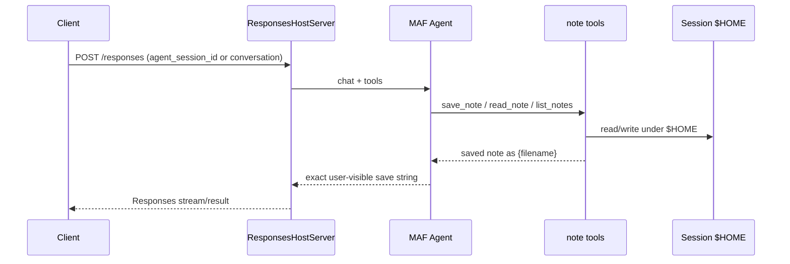

# Foundry hosted notes agent (`test_hr`)

Microsoft Agent Framework (MAF) Python agent deployed as an Azure AI Foundry **hosted agent** (Responses protocol **2.0.0**, code deploy). The model saves and reads **one file per note** under the session `$HOME` sandbox via `@tool` helpers.

This repository ships templates + code + CI. Reviewing the PR does **not** require a live Azure deploy.

## Locked behavior

| Item | Choice |
|------|--------|
| Stack | MAF + `ResponsesHostServer` (not BYO `azure-ai-agentserver-*`) |
| Save reply | Exactly `saved note as {filename}` (tool return + agent instructions) |
| Files | One file per note under `$HOME`; model-chosen sanitized basename; default `.txt`; overwrite OK; reject `..` / absolute paths |
| Model deployment | `gpt-4.1-mini` in `azure.yaml` |
| Protocol | Responses `2.0.0` |
| Deploy mode | Code (`language: python` + `codeConfiguration`) |
| Model env | Prefer `AZURE_AI_MODEL_DEPLOYMENT_NAME`; also accept `MICROSOFT_FOUNDRY_MODEL_DEPLOYMENT_NAME` |

## Naming (where the Foundry project comes from)

Three different names appear in this repo. Do not mix them up:

| Name | Where it is set | What it is |
|------|-----------------|------------|
| **azd environment / app name** | Root `azure.yaml` → `name: test-hr-notes` | Local `azd` project name. Used when you run `azd init` / `azd up` from this repo. Change it only if you want a different azd env prefix. |
| **Foundry project** | Created by **`azd provision`** from the `ai-project` service (`host: azure.ai.project`) in `azure.yaml`, **or** chosen/created when you run `azd ai agent init` | The Azure AI Foundry **project** that owns model deployments and hosted agents. Its endpoint becomes `FOUNDRY_PROJECT_ENDPOINT` (injected in cloud; you paste it locally). |
| **Hosted agent name** | `azure.yaml` → `services.notes-agent.name: notes-agent` | The agent resource name inside that Foundry project (`kind: hosted`). |

**Where you create / pick the Foundry project name in practice:**

1. **Greenfield (recommended with this repo):** run `azd auth login`, then `azd up` (or `azd provision`) from the repo root. `azd` synthesizes a Foundry account + **Foundry project** from `services.ai-project` and stores the endpoint in `.azure/<env>/.env` as `FOUNDRY_PROJECT_ENDPOINT`. You are prompted for Azure subscription, location, and environment name; the Foundry project is created in that flow (not by editing a free-text field inside `notes.py`).
2. **Existing Foundry project:** run `azd ai agent init` and select an existing project when prompted, **or** set `FOUNDRY_PROJECT_ENDPOINT` yourself to  
   `https://<foundry-account>.services.ai.azure.com/api/projects/<foundry-project-name>`  
   where `<foundry-project-name>` is the project you already created in the [Azure AI Foundry portal](https://ai.azure.com) (Create project) or via Azure APIs.
3. **Do not** put the Foundry project name in `azure.yaml` `env` as a `FOUNDRY_*` key — those prefixes are platform-reserved. The cloud runtime injects `FOUNDRY_PROJECT_ENDPOINT` for you after provision/deploy.

## Layout

```text
azure.yaml
src/notes-agent/
  main.py              # Agent + tools + ResponsesHostServer.run()
  notes.py             # $HOME sanitize / save / read / list
  requirements.txt
  .env.example
  .agentignore
tests/test_notes.py
.github/workflows/ci.yml
pyproject.toml
README.md
.grok/
```

## Architecture



**Session vs conversation:** keep a stable `agent_session_id` (or `conversation`) across turns so `$HOME` notes persist. `previous_response_id` alone continues model history but does **not** reuse the session filesystem.

## Filename rules

- Allowed characters after sanitize: letters, digits, `-`, `_`, `.`
- Single path segment only; no absolute paths; no `..`
- If the sanitized name has no extension, `.txt` is appended
- Overwrite of an existing file is allowed
- `list_notes` only returns `.txt` / `.md` files under `$HOME`
- Save tool return (and required user-visible reply): `saved note as {filename}` with the final on-disk basename

---

## How to run locally (step by step)

### A. Prerequisites

1. Python **3.12+** (3.13 matches `azure.yaml` `codeConfiguration.runtime`).
2. Azure CLI + login: `az login`.
3. [Azure Developer CLI (`azd`)](https://learn.microsoft.com/en-us/azure/developer/azure-developer-cli/install-azd) **≥ 1.27.1**.
4. Install azd extensions (versions per `azure.yaml`):
   ```bash
   azd ext install azure.ai.agents
   azd ext install azure.ai.projects
   ```
5. Clone this repo and `cd` to the repo root.

### B. Create or select the Foundry project (once)

Pick **one**:

**Option 1 — let `azd` create it (greenfield)**

```bash
azd auth login
azd env new test-hr-notes-dev   # or any env name you like
azd provision                  # creates Foundry account + project from azure.yaml ai-project
```

When prompted, choose subscription and region. After provision, open `.azure/<env>/.env` and confirm `FOUNDRY_PROJECT_ENDPOINT` and `AZURE_AI_MODEL_DEPLOYMENT_NAME` are set. Confirm the model catalog version for `gpt-4.1-mini` in your region; if needed, edit `azure.yaml` `services.ai-project.deployments[0].model.version` and re-run provision.

**Option 2 — use an existing Foundry project**

1. In [ai.azure.com](https://ai.azure.com), open (or **Create**) a Foundry **project**. Note the project name and account.
2. Ensure a chat deployment named like `gpt-4.1-mini` exists (or update names in `azure.yaml` + env to match).
3. Copy the project endpoint into your local env (shape below).

### C. Configure local environment

```bash
cp src/notes-agent/.env.example src/notes-agent/.env
```

Edit `src/notes-agent/.env`:

```bash
FOUNDRY_PROJECT_ENDPOINT=https://<account>.services.ai.azure.com/api/projects/<foundry-project-name>
AZURE_AI_MODEL_DEPLOYMENT_NAME=gpt-4.1-mini
# Optional fallback if the preferred var is unset:
# MICROSOFT_FOUNDRY_MODEL_DEPLOYMENT_NAME=gpt-4.1-mini
```

`<foundry-project-name>` is the Foundry **project** from step B (portal or `azd provision`), not the azd `name: test-hr-notes` field.

### D. Install deps and start the Responses host

```bash
cd src/notes-agent
python -m venv .venv
source .venv/bin/activate   # Windows: .venv\Scripts\activate
pip install -r requirements.txt
# Hosting package is prerelease; if pip skips it:
# pip install --pre agent-framework-foundry-hosting==1.0.0b260903
python main.py
```

The host listens on **port 8088**, path **`POST /responses`** (Responses protocol 2.0.0).

### E. Invoke locally

Use `azd ai agent invoke` (with the agent configured), or any Responses-compatible client against `http://127.0.0.1:8088/responses`.

For multi-turn **note retrieve**, pass a stable `agent_session_id` or `conversation` on each call so `$HOME` is reused.

### F. Run unit tests / lint locally

From repo root:

```bash
pip install -r requirements-dev.txt
ruff check src tests
ruff format --check src tests
(cd src/notes-agent && mypy notes.py main.py)
pytest -q
```

---

## How to run in the cloud (Foundry hosted agent)

### 1. Prerequisites

Same as local: `az login`, `azd auth login`, extensions installed, repo checked out.

### 2. Provision Azure resources (Foundry project + model)

From repo root:

```bash
azd auth login
azd env new test-hr-notes-dev    # skip if env already exists
azd provision
```

This creates (via `azure.yaml`):

- Foundry / AI project from `services.ai-project`
- Model deployment `gpt-4.1-mini` (verify `version` against the regional catalog)
- Supporting resources `azd` synthesizes for hosted agents (identity, App Insights, etc.)

**Foundry project name:** created/selected in this provision / `azd ai agent init` flow. Read the resulting endpoint from `.azure/<env>/.env` → `FOUNDRY_PROJECT_ENDPOINT` (path segment after `/projects/` is the project name).

### 3. Deploy the hosted agent (code mode)

```bash
azd deploy
# or both provision + deploy:
# azd up
```

`services.notes-agent` deploys `src/notes-agent` with:

- `language: python` / `codeConfiguration.runtime: python_3_13` / `entryPoint: main.py`
- protocol `responses` **2.0.0**
- agent name **`notes-agent`**
- `AZURE_AI_MODEL_DEPLOYMENT_NAME` wired from the environment

Foundry injects `FOUNDRY_PROJECT_ENDPOINT` into the container — do **not** declare `FOUNDRY_*` / `AGENT_*` under `azure.yaml` `env`.

### 4. Run / invoke in the cloud

```bash
azd ai agent run          # if using the agents extension run helpers
azd ai agent invoke       # send a prompt to the deployed agent
azd ai agent show         # inspect deployment / endpoint metadata
```

In the Foundry portal: open your **project** → Agents → **`notes-agent`** → test/chat. For multi-turn notes, keep the same session (`agent_session_id` / `conversation`).

### 5. Tear down (optional)

```bash
azd down
```

---

## CI

GitHub Actions (`.github/workflows/ci.yml`) on pull requests to `main` runs:

- `ruff check src tests`
- `ruff format --check src tests`
- `mypy` on `src/notes-agent` (`notes.py`, `main.py`)
- `pytest -q`

Dev pins: `requirements-dev.txt` / `pyproject.toml` (`ruff==0.16.6`, `mypy==2.3.1`, `pytest>=8.0`).

## Package pins

| Package | Version |
|---------|---------|
| `agent-framework` | `1.17.0` |
| `agent-framework-foundry` | `1.12.0` |
| `agent-framework-foundry-hosting` | `1.0.0b260903` |
| `azure-identity` | `1.25.3` |

## References

- [Foundry Hosted Agents (Agent Framework)](https://learn.microsoft.com/en-us/agent-framework/hosting/foundry-hosted-agent)
- [Host MAF as Foundry hosted agents](https://learn.microsoft.com/en-us/azure/foundry/how-to/develop/framework-hosted-agents)
- [Manage hosted agent sessions](https://learn.microsoft.com/en-us/azure/foundry/agents/how-to/manage-hosted-sessions)
- [azure.yaml reference](https://learn.microsoft.com/en-us/azure/foundry/agents/concepts/azure-yaml-reference)
- [CLI infrastructure](https://learn.microsoft.com/en-us/azure/foundry/agents/concepts/cli-infrastructure)
