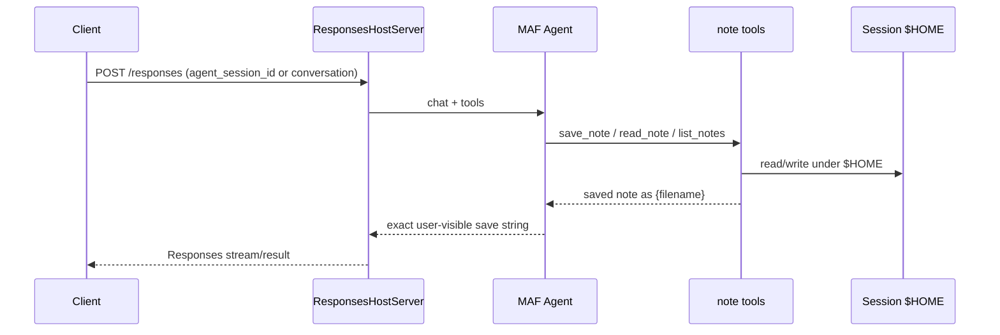

# Foundry hosted notes agent (`test_hr`)

Microsoft Agent Framework (MAF) Python agent deployed as an Azure AI Foundry **hosted agent** (Responses protocol **2.0.0**, code deploy). The model saves and reads **one file per note** under the session `$HOME` sandbox via `@tool` helpers.

This repository ships templates + code + CI. **No live Azure provision/deploy is required** to review this work.

## Locked behavior

| Item | Choice |
|------|--------|
| Stack | MAF + `ResponsesHostServer` (not BYO `azure-ai-agentserver-*`) |
| Save reply | Exactly `saved note as {filename}` (tool return + agent instructions) |
| Files | One file per note under `$HOME`; model-chosen sanitized basename; default `.txt`; overwrite OK; reject `..` / absolute paths |
| Model deployment | `gpt-4.1-mini` in `azure.yaml` |
| Protocol | Responses `2.0.0` |
| Deploy mode | Code (`language: python` + `codeConfiguration`) |
| Model env | Prefer `AZURE_AI_MODEL_DEPLOYMENT_NAME`; also accept `MICROSOFT_FOUNDRY_MODEL_DEPLOYMENT_NAME` |

## Layout

```text
azure.yaml
src/notes-agent/
  main.py              # Agent + tools + ResponsesHostServer.run()
  notes.py             # $HOME sanitize / save / read / list
  requirements.txt
  .env.example
  .agentignore
.github/workflows/ci.yml
pyproject.toml
README.md
.grok/
```

## Architecture



**Session vs conversation:** keep a stable `agent_session_id` (or `conversation`) across turns so `$HOME` notes persist. `previous_response_id` alone continues model history but does **not** reuse the session filesystem.

## Filename rules

- Allowed characters after sanitize: letters, digits, `-`, `_`, `.`
- Single path segment only; no absolute paths; no `..`
- If the sanitized name has no extension, `.txt` is appended
- Overwrite of an existing file is allowed
- Save tool return (and required user-visible reply): `saved note as {filename}` with the final on-disk basename

## Local / `azd` guidance (no deploy required for DoD)

1. Install [azd](https://learn.microsoft.com/en-us/azure/developer/azure-developer-cli/install-azd) and extensions (`azure.ai.agents`, `azure.ai.projects`) per `azure.yaml` `requiredVersions`.
2. From a working directory with this repo: `azd auth login`, then `azd ai agent init` (or point init at this `azure.yaml`).
3. Confirm the regional catalog version for `gpt-4.1-mini`. If that model is unavailable, pick the cheapest mini-tier OpenAI chat deployment the catalog offers (samples sometimes show newer mini SKUs) and update `azure.yaml` + `AZURE_AI_MODEL_DEPLOYMENT_NAME`.
4. Copy `src/notes-agent/.env.example` to `.env` for local runs; Foundry injects `FOUNDRY_PROJECT_ENDPOINT` in hosted containers — do **not** declare reserved `FOUNDRY_*` / `AGENT_*` keys under `azure.yaml` `env`.
5. Optional local host: install `src/notes-agent/requirements.txt` (hosting package is prerelease), set env vars, run `python main.py` from `src/notes-agent` (default `/responses` on port 8088).
6. When you are ready to provision later: `azd provision` / `azd deploy` / `azd ai agent run` / `azd ai agent invoke`. Pass `agent_session_id` or use `conversation` for multi-turn note retrieve.

## CI

GitHub Actions (`.github/workflows/ci.yml`) on pull requests to `main` runs:

- `ruff check src`
- `ruff format --check src`
- `mypy` on `src/notes-agent` (`notes.py`, `main.py`)

Dev pins: `requirements-dev.txt` / `pyproject.toml` (`ruff==0.16.6`, `mypy==2.3.1`).

## Package pins

| Package | Version |
|---------|---------|
| `agent-framework` | `1.17.0` |
| `agent-framework-foundry` | `1.12.0` |
| `agent-framework-foundry-hosting` | `1.0.0b260903` |
| `azure-identity` | `1.25.3` |

## References

- [Foundry Hosted Agents (Agent Framework)](https://learn.microsoft.com/en-us/agent-framework/hosting/foundry-hosted-agent)
- [Host MAF as Foundry hosted agents](https://learn.microsoft.com/en-us/azure/foundry/how-to/develop/framework-hosted-agents)
- [Manage hosted agent sessions](https://learn.microsoft.com/en-us/azure/foundry/agents/how-to/manage-hosted-sessions)
- [azure.yaml reference](https://learn.microsoft.com/en-us/azure/foundry/agents/concepts/azure-yaml-reference)
